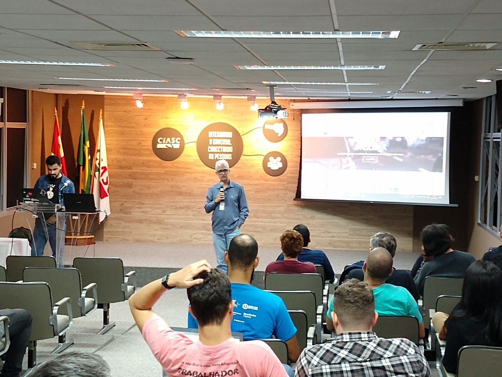

# Relatório Florianópolis 24/05/2019

## Informações Gerais

Número de participantes | Local | Data/Hora
 --- | --- | --- 
45 pessoas | Ciasc (Centro de Informática e Automação do Estado de Santa Catarina) | 24 e 25 de maio de 2019 |

O Ciasc, Centro de Informática e Automação do Estado de Santa Catarina, é uma empresa pública, que há mais de 40 anos desenvolve soluções tecnológicas para que o Governo do Estado e dos Municípios entreguem à população catarinense serviços mais modernos, ágeis e inovadores. A empresa é responsável por infraestrutura de redes e serviços de datacenter para o governo de Santa Catarina.

## Contribuições

Com o lugar ideal e quase 50 participantes engajados em diversas atividades técnicas, como estudos para a otimização da Rosie, foram feitas várias análises, relativas aos dados públicos das cotas dos deputados federais. Ao total, foram abertos sete Pull Requests no repositório principal do projeto serenata de amor. (https://github.com/okfn-brasil/serenata-de-amor/pulls)

Destacam-se as seguintes contribuições:

* Várias atualizações na documentação do projeto, o que auxilia a preparação de ambiente para quem deseja reproduzir a execução da Rosie e Jarbas localmente.
* Iniciaram-se trabalhos para otimização de memória no tratamento de dados da Rosie.
* Inclusão de links para perfis de redes sociais nas notas da base de dados do Jarbas.

O grupo de Florianópolis, por exemplo, ainda continua com ideias e sugestões, mesmo após o término do sprint. O objetivo é que o projeto ainda ganhe mais melhorias e sugestões, vinda da comunidade que irá se formar em torno dos eventos. Como dizemos, o Serenata não é nosso. Nós precisamos e queremos ter a população colaborando de perto em todos os momentos do projeto.
